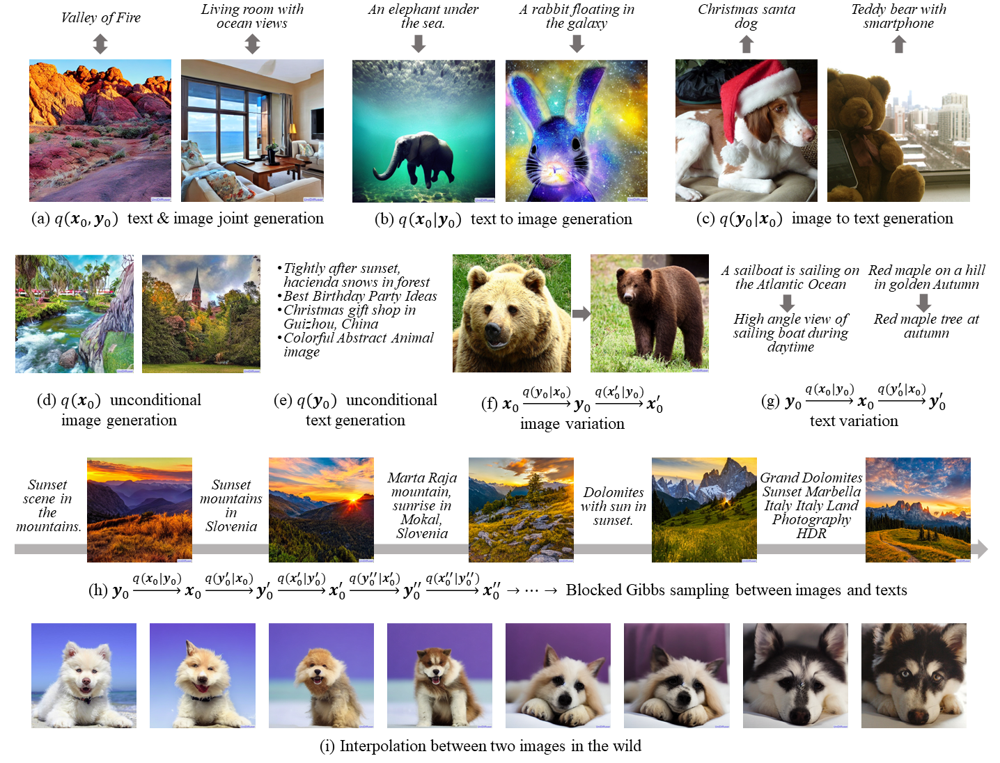
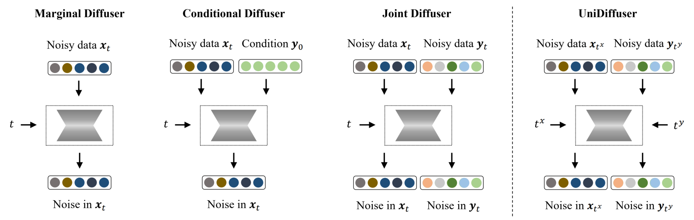

## UniDiffuser

Code and models for the paper ["One Transformer Fits All Distributions in Multi-Modal Diffusion"](https://arxiv.org/abs/2303.06555)

[](https://huggingface.co/spaces/thu-ml/unidiffuser)
[](https://colab.research.google.com/github/thu-ml/unidiffuser/blob/main/UniDiffuser.ipynb)
[](https://replicate.com/cjwbw/unidiffuser)
[](https://huggingface.co/docs/diffusers/main/en/api/pipelines/unidiffuser)


UniDiffuser is a unified diffusion framework to fit all distributions relevant to a set of multi-modal data in one model. 
Its key insight is -- learning diffusion models for marginal, conditional, and joint distributions can be unified as predicting the noise in the perturbed data, where the perturbation levels (i.e. timesteps) can be different for different modalities. 
Inspired by the unified view, UniDiffuser learns all distributions simultaneously with a minimal modification to the original diffusion model -- perturbs data in all modalities instead of a single modality, inputs individual timesteps in different modalities, and predicts the noise of all modalities instead of a single modality. 
UniDiffuser is parameterized by a transformer for diffusion models to handle input types of different modalities. 
Implemented on large-scale paired image-text data, UniDiffuser is able to perform image, text, text-to-image, image-to-text, and image-text pair generation by setting proper timesteps without additional overhead. 
In particular, UniDiffuser is able to produce perceptually realistic samples in all tasks and its quantitative results (e.g., the FID and CLIP score) are not only superior to existing general-purpose models but also comparable to the bespoken models (e.g., Stable Diffusion and DALL-E 2) in representative tasks (e.g., text-to-image generation).



--------------------

## Dependency

```sh
conda create -n unidiffuser python=3.9
conda activate unidiffuser
pip install torch torchvision --extra-index-url https://download.pytorch.org/whl/cu116  # install torch-1.13.1
pip install accelerate==0.12.0 absl-py ml_collections einops ftfy==6.1.1 transformers==4.23.1
pip install -e git+https://github.com/openai/CLIP.git@main#egg=clip

# xformers is optional, but it would greatly speed up the attention computation.
pip install -U xformers
pip install -U --pre triton
```

* We highly suggest install [xformers](https://github.com/facebookresearch/xformers), which would greatly speed up the attention computation for *both training and inference*.


## Pretrained Models

UniDiffuser employs a variation of transformer, called [U-ViT](https://github.com/baofff/U-ViT), which parameterizes the joint noise prediction network. Other components perform as encoders and decoders of different modalities, including a pretrained image autoencoder from [Stable Diffusion](https://github.com/CompVis/stable-diffusion), a pretrained [image ViT-B/32 CLIP encoder](https://github.com/openai/CLIP), a pretrained [text ViT-L CLIP encoder](https://huggingface.co/openai/clip-vit-large-patch14), and a [GPT-2](https://github.com/openai/gpt-2) text decoder finetuned by ourselves.


We provide two versions of UniDiffuser, which contain U-ViT of 1B parameters and can run on a GPU with at least 10 GB memory. They can be downloaded from Hugging Face:
- [UniDiffuser-v0](https://huggingface.co/thu-ml/unidiffuser-v0): This version is trained on [LAION-5B](https://laion.ai/) at 512x512 resolution, which contains noisy webdata of text-image pairs.
- [UniDiffuser-v1](https://huggingface.co/thu-ml/unidiffuser-v1): This version is resumed from UniDiffuser-v0, and is further trained with a set of less noisy internal text-image pairs. It uses a flag as its input to distinguish webdata and internal data during training.

Both links contain three files:
- `autoencoder_kl.pth` is the weight of the image autoencoder converted from [Stable Diffusion](https://github.com/CompVis/stable-diffusion).
- `caption_decoder.pth` is the weight of the finetuned GPT-2 text decoder.
- `uvit_v0.pth or uvit_v1.pth` is the weight of U-ViT for UniDiffuser-v0 or UniDiffuser-v1.

Note that UniDiffuser-v0 and UniDiffuser-v1 share the same `autoencoder_kl.pth` and `caption_decoder.pth`. You only need to download them once.
As for other components, they will be automatically downloaded.


After downloading, create a new folder named `models` and put all pretrained models into this folder as follows:

```
├── models
│   └── autoencoder_kl.pth
│   └── caption_decoder.pth
│   └── uvit_v0.pth or uvit_v1.pth
```

## Inference

We suggest to use UniDiffuser-v1 for a better performance. Results are put into `out` directory by default.

* **text-to-image generation**
```shell
python sample_multi_v1.py --mode=t2i --prompt="an elephant under the sea"
```
* **image-to-text generation**
```shell
python sample_multi_v1.py --mode=i2t --img=assets/space.jpg
```

* **joint generation**
```shell
python sample_multi_v1.py --mode=joint
```

* **image generation**
```shell
python sample_multi_v1.py --mode=i
```

* **text generation**
```shell
python sample_multi_v1.py --mode=t
```

* **image variation**
```shell
python sample_multi_v1.py --mode=i2t2i --img=assets/space.jpg
```

* **text variation**
```shell
python sample_multi_v1.py --mode=t2i2t --prompt="an elephant under the sea"
```

We provide all supported arguments below
```
all supported arguments:
    --mode                          type of generation, one of t2i / i2t / joint / i / t / i2t2i/ t2i2t
                                        t2i: text to image
                                        i2t: image to text
                                        joint: joint generation of text and image
                                        i: only generate image
                                        t: only generate text
                                        i2t2i: image variation, first image to text, then text to image
                                        t2i2t: text variation, first text to image, the image to text
    --prompt                        the prompt for text-to-image generation and text variation
    --img                           the image path for image-to-text generation and image variation
    --n_samples                     the number of samples to generate, default is 1
    --nrow                          number of images displayed in each row of the grid, default is 4
    --output_path                   dir to write results to, default is out
    --config.seed                   random seed, default is 1234
    --config.sample.sample_steps    number of dpm_solver sampling steps, default is 50
    --config.sample.scale           the classfier-free guidance for conditional generation, default is 7
    --config.sample.t2i_cfg_mode    used for text-to-image generation, one of true_uncond / empty_token, default is true_uncond
                                        true_uncond: use the unconditional model of UniDiffuser to perform classifier-free guidance
                                        empty_token: use the empty string to perform classifier-free guidance
    --config.data_type              one of 0 / 1, used for UniDiffuser-v1, default is 1
                                        0: corresponds to WebDataset during training
                                        1: corresponds to internal data during training
```


The inference command of UniDiffuser-v0 is basically the same as UniDiffuser-v1, only need to change 
`sample_multi_v1.py` to `sample_multi_v0.py`. For example:
```shell
python sample_multi_v0.py --mode=t2i --prompt="an elephant under the sea"
```

## Integration with 🧨 diffusers

UniDiffuser is also available in 🧨 diffusers. It is available in six different modes. 
Here is how one can use the `UniDiffuserPipeline` to generate images from text:

```python
import torch
from diffusers import UniDiffuserPipeline

device = "cuda"
model_id_or_path = "thu-ml/unidiffuser-v1"
pipe = UniDiffuserPipeline.from_pretrained(model_id_or_path, torch_dtype=torch.float16)
pipe.to(device)

# Text-to-image generation
prompt = "an elephant under the sea"

sample = pipe(prompt=prompt, num_inference_steps=20, guidance_scale=8.0)
t2i_image = sample.images[0]
t2i_image.save("unidiffuser_text2img_sample_image.png")
```

To learn more details, check out the official [UniDiffuser documentation](https://huggingface.co/docs/diffusers/main/en/api/pipelines/unidiffuser). 


## References
If you find the code useful for your research, please consider citing
```bib
@article{bao2022one,
  title={One Transformer Fits All Distributions in Multi-Modal Diffusion at Scale},
  author={Bao, Fan and Nie, Shen and Xue, Kaiwen and Li, Chongxuan and Pu, Shi and Wang, Yaole and Yue, Gang and Cao, Yue and Su, Hang and Zhu, Jun},
  year={2023}
}

@inproceedings{bao2022all,
  title={All are Worth Words: A ViT Backbone for Diffusion Models},
  author={Bao, Fan and Nie, Shen and Xue, Kaiwen and Cao, Yue and Li, Chongxuan and Su, Hang and Zhu, Jun},
  booktitle = {CVPR},
  year={2023}
}
```

This implementation is heavily based on the [U-ViT](https://github.com/baofff/U-ViT) code.
